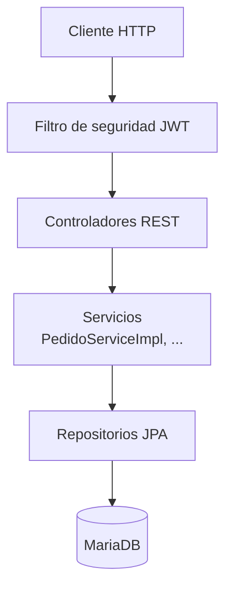
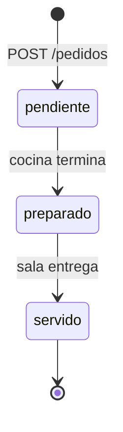
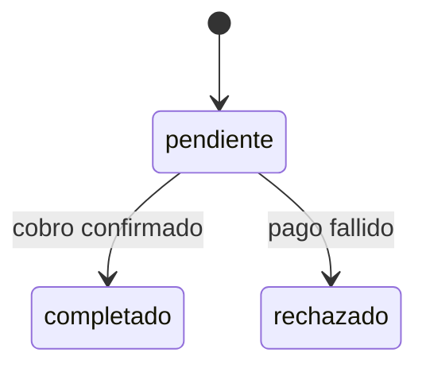
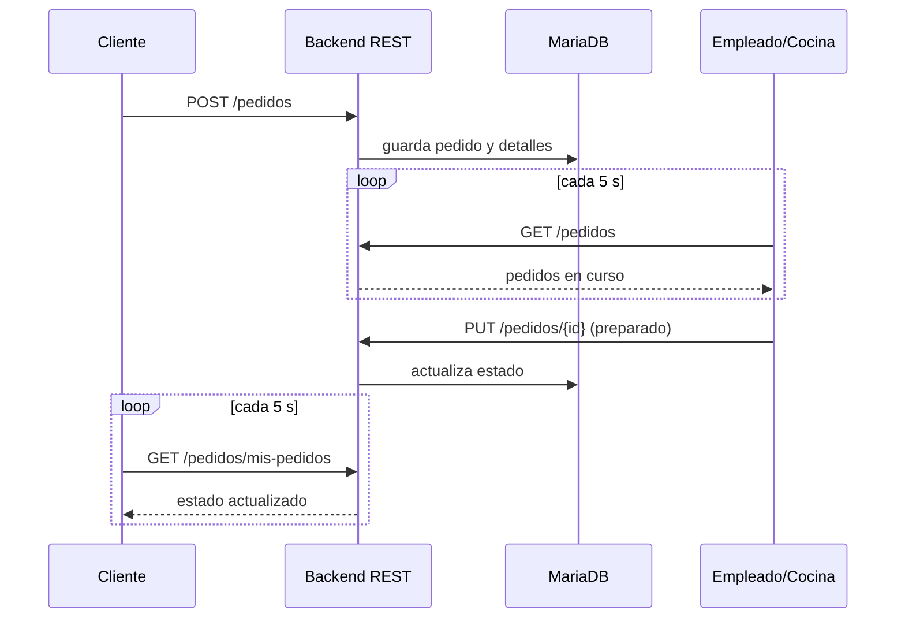

# Backend

El backend de BarHub 2.0 expone una **API REST** securizada con JWT. El frontend consulta los cambios de comandas, mesas y caja mediante sondeo periódico (cada 5 s); no hay canal de tiempo real.

## Índice

1. [Stack tecnológico](#1-stack-tecnológico)
2. [Arquitectura en capas](#2-arquitectura-en-capas)
3. [API REST](#3-api-rest)
4. [Roles y control de acceso](#4-roles-y-control-de-acceso)
5. [Ciclo de vida de un pedido](#5-ciclo-de-vida-de-un-pedido)
6. [Actualización de datos](#6-actualización-de-datos)
7. [Calidad del código](#7-calidad-del-código)

---

## 1. Stack tecnológico

| Componente | Tecnología | Notas |
| :--- | :--- | :--- |
| Lenguaje / framework | Java 21 + **Spring Boot 4.2.0** | Spring Framework 7, Spring Security 7, Hibernate 7, Tomcat 11 y Jackson 3. Migrado desde 3.5.16 en la 2.1 ([auditorias.md](auditorias.md)) |
| Build | Gradle | `./gradlew clean build -x test` |
| Base de datos | **MariaDB** | Modelo ER en [base-de-datos.md](base-de-datos.md) |
| Autenticación | **JWT** (`jjwt 0.13.0`, serialización con Gson) | Implementado en `JwtUtils.java` con el API moderno |
| Conector BBDD | `mariadb-java-client` 4.0.0 | TLS por defecto con el certificado del servidor verificado ([evidencia](evidencias/tls-mariadb-2026-11-20.md)) |
| JSON | Jackson 3 con `spring.jackson.use-jackson2-defaults` | La API acepta y devuelve el mismo JSON que con Spring Boot 3.5 |
| Actualización de datos | Sondeo REST desde el frontend | Ver [sección 6](#6-actualización-de-datos) |
| Fechas | `java.time` / `Instant` | Sustituye al obsoleto `new Date()` |

## 2. Arquitectura en capas

```mermaid
flowchart TB
    CL[Cliente HTTP] --> SEC[Filtro de seguridad JWT]
    SEC --> CTRL[Controladores REST]
    CTRL --> SRV[Servicios<br/>PedidoServiceImpl, ...]
    SRV --> REPO[Repositorios JPA]
    REPO --> DB[(MariaDB)]
```

| Capa | Responsabilidad |
| :--- | :--- |
| **Seguridad** | Valida el JWT y carga `UserDetailsImpl` con sus roles |
| **Controladores** | Reciben peticiones, validan entrada y devuelven respuestas HTTP estandarizadas |
| **Servicios** | Lógica de negocio. Métodos extensos desglosados en auxiliares privados cohesivos |
| **Repositorios** | Acceso a datos |
| **Modelo / `model/enums`** | Entidades y enumerados (estados, tipos de pedido, categorías) |

`spring.jpa.open-in-view` está desactivado: la sesión de Hibernate termina con la transacción del servicio, no con la petición. Por eso los controladores solo convierten a DTO lo que ya está cargado, y las relaciones perezosas que necesita la respuesta se piden en el repositorio con `@EntityGraph` (detalles y productos de los pedidos, roles de los usuarios) o se leen dentro de un método `@Transactional`. Si un endpoint nuevo recorre una relación sin cargarla, falla con `LazyInitializationException`; `CargaPerezosaIntegrationTest` lo comprueba sin transacción en el test, que ocultaría el fallo.

## 3. API REST

### 3.1. Autenticación · `/auth`

Las rutas se muestran como las ve el backend. Desde fuera, Caddy las publica bajo el prefijo `/api` (por ejemplo, `/api/auth/login`).

| Método | Endpoint | Descripción |
| :--- | :--- | :--- |
| `POST` | `/auth/signup` | Registro de nuevos usuarios (clientes o personal) |
| `POST` | `/auth/login` | Inicio de sesión: token de acceso JWT (15 min) en el cuerpo y cookie `HttpOnly` de renovación; `403 EMAIL_NO_VERIFICADO` si falta confirmar el correo. Si la cuenta usa (o su rol exige) la verificación en dos pasos, responde `{requiere2fa, configurar, desafio}` sin token |
| `POST` | `/auth/2fa/verificar` | Segundo paso con el desafío y el código de la app o uno de recuperación; abre la sesión como el login (`401 CODIGO_INCORRECTO` o `DESAFIO_CADUCADO`) |
| `POST` | `/auth/2fa/configurar` | Para quien aún no la tiene: secreto nuevo (clave Base32 y URI `otpauth://` para el QR) |
| `POST` | `/auth/2fa/activar` | Activa la verificación con el primer código de la app, abre la sesión y devuelve los 10 códigos de recuperación |
| `GET` | `/perfil/seguridad` | Con sesión: correo verificado, estado de la verificación en dos pasos (activa, obligatoria, códigos restantes) y fecha de alta |
| `PUT` | `/perfil/password` | Cambia la propia contraseña con la actual y cierra las demás sesiones |
| `POST` | `/perfil/dos-factores/configurar`, `/perfil/dos-factores/activar` | Activa la verificación en dos pasos desde el perfil (activar exige reautenticación) |
| `POST` | `/perfil/dos-factores/codigos` | Genera 10 códigos de recuperación nuevos y anula los anteriores (reautenticación) |
| `DELETE` | `/perfil/dos-factores` | La desactiva, si su rol no la exige (reautenticación) |
| `GET` / `DELETE` | `/perfil/sesiones`, `/perfil/sesiones/{id}` | Sus sesiones abiertas; cerrar una o todas las demás |
| `POST` | `/perfil/correo` | Pide cambiar el correo: envía un enlace al nuevo y un aviso al actual; la cuenta no cambia hasta abrirlo (`202`; `409` si otra cuenta lo usa, `429` si pidió otro hace menos de un minuto; reautenticación) |
| `DELETE` | `/perfil/correo` | Cancela el cambio de correo pendiente: el enlace deja de valer |
| `GET` | `/perfil/mis-datos` | Descarga en JSON todo lo que se guarda de la cuenta (datos, dirección, pedidos, sesiones, registro de jornada), sin contraseña ni secretos (reautenticación) |
| `DELETE` | `/perfil` | Elimina la cuenta de un cliente: la anonimiza, conserva sus pedidos sin datos personales y cierra sus sesiones (`400` para el personal; reautenticación) |
| `POST` | `/auth/reautenticar` | Con sesión: confirma de nuevo la identidad (código de la app o, sin 2FA, contraseña) para las acciones críticas de los 5 minutos siguientes; `400 CODIGO_INCORRECTO` si no vale |
| `POST` | `/auth/refresh` | Token de acceso nuevo a partir de la cookie, que se rota; `401` si la sesión está cerrada o caducada |
| `POST` | `/auth/logout` | Cierra la sesión en el servidor y borra la cookie (`204`) |
| `POST` | `/auth/verificar` | Confirma el correo con el token del enlace (`400` si no vale o ha caducado) |
| `POST` | `/auth/reenviar-verificacion` | Vuelve a enviar el correo de confirmación (respuesta genérica) |
| `POST` | `/auth/recuperar` | Envía el enlace para restablecer la contraseña (respuesta genérica) |
| `POST` | `/auth/restablecer` | Contraseña nueva con el token del enlace; cierra todas las sesiones de la cuenta |
| `POST` | `/auth/confirmar-cambio-correo` | Pone en la cuenta el correo nuevo con el token del enlace (ya verificado) y avisa al anterior (`400` si no vale, `409` si otra cuenta lo ha ocupado entretanto) |

### 3.2. Mesas · `/mesas`

| Método | Endpoint | Descripción |
| :--- | :--- | :--- |
| `GET` | `/mesas` | Listado de mesas y estado actual (`disponible`, `ocupada`, `reservada`) |
| `PUT` | `/mesas/{id}` | Actualiza el estado de una mesa y su vinculación |

### 3.3. Productos · `/productos`

El listado y la creación se sirven en `/productos/` (con barra final).

| Método | Endpoint | Descripción |
| :--- | :--- | :--- |
| `GET` | `/productos/` | Menú completo, filtrable por categoría (`bebida`, `entrante`, `postre`, `tapa`) |
| `POST` | `/productos/` | Crea un producto (datos y, opcionalmente, imagen). **Solo administradores** |
| `PUT` | `/productos/{id}` | Actualiza un producto y, si se envía, su imagen. **Solo administradores** |
| `DELETE` | `/productos/{id}` | Elimina un producto y su imagen. **Solo administradores** |

### 3.4. Pedidos y comandas · `/pedidos`

| Método | Endpoint | Descripción |
| :--- | :--- | :--- |
| `GET` | `/pedidos` | Pedidos en curso para sala y cocina |
| `POST` | `/pedidos` | Crea un pedido indicando modalidad: `domicilio`, `mesa` o `recoger` |
| `PUT` | `/pedidos/{id}` | Avanza el flujo: `pendiente` → `preparado` → `servido` |
| `GET` | `/pedidos/pendientes-efectivo` | Pedidos con pago en efectivo aún pendiente |
| `GET` | `/pedidos/mis-pedidos` | Seguimiento de los pedidos del cliente autenticado |

### 3.5. Caja y turnos · `/caja`

| Método | Endpoint | Descripción |
| :--- | :--- | :--- |
| `GET` | `/caja/actual` | Estado de la caja abierta |
| `GET` | `/caja/historial` | Histórico de turnos |
| `POST` | `/caja/abrir` | Abre turno registrando el monto inicial |
| `POST` | `/caja/cerrar` | Cierra turno calculando ventas en efectivo y tarjeta, efectivo real y descuadre |

### 3.5.1. Registro de jornada · `/turnos`

El turno de un empleado empieza al iniciar sesión. Termina con «Terminar turno» o, si no lo pulsa, cuando ya no le queda ninguna sesión abierta: una tarea cada 5 minutos lo cierra con la hora de su última actividad real, no con la caducidad de la sesión.

| Método | Endpoint | Quién | Descripción |
| :--- | :--- | :--- | :--- |
| `GET` | `/turnos/actual` | Empleado o admin | Su turno en curso, o `204` si no tiene |
| `POST` | `/turnos/terminar` | Empleado o admin | Registra la salida ahora; `409` si no hay turno abierto |
| `GET` | `/turnos?desde=AAAA-MM-DD&hasta=AAAA-MM-DD` | Admin | Turnos del rango (por defecto, los últimos 7 días; como mucho un año) |

### 3.6. Subida de imágenes (productos y perfiles)

| Control | Detalle |
| :--- | :--- |
| Extensión | Lista blanca: `jpg`, `jpeg`, `png`, `webp` |
| Tipo declarado | `Content-Type` de tipo `image/*` |
| Contenido real | Comprobación de la firma del archivo (magic bytes) |
| Tamaño | 5 MB por archivo y 6 MB por petición |
| Nombre | Generado por el servidor con sufijo aleatorio; nunca el del cliente |
| Ruta | Normalizada y comprobada dentro de la carpeta de destino |
| Sustitución y borrado | La imagen anterior se elimina solo tras guardar la nueva; también al borrar el registro |

### 3.7. Avisos de la política de seguridad de contenido · `/csp-informe`

| Método | Ruta | Acceso | Descripción |
| :--- | :--- | :--- | :--- |
| `POST` | `/csp-informe` | Público | El navegador avisa de lo que ha bloqueado la CSP de Caddy (`report-uri`). Se anota en el log con el prefijo `CSP:` (directiva, recurso bloqueado, página y fichero de origen). Lee como mucho 16 KB, recorta cada campo a 200 caracteres sin saltos de línea, anota como mucho 60 avisos por minuto y responde siempre `204` |

## 4. Roles y control de acceso

Se definen en la tabla `roles` (relación N:M con `users` mediante `user_roles`):

| Rol | Descripción |
| :--- | :--- |
| `role_cliente` | Usuario final: carta, pedidos y seguimiento |
| `role_empleado` | Personal: comandas, mesas, efectivo y caja |
| `role_admin` | Gerencia: gestión completa y métricas |

El acceso se aplica a dos niveles: **backend** (Spring Security con el JWT y los roles de `UserDetailsImpl`) y **frontend** (`auth.guard.ts` / `role.guard.ts`). El backend es la barrera real; los guardas del frontend solo mejoran la experiencia.

**Denegación por defecto.** `SecurityConfig` solo permite de forma explícita `/auth/**` y las lecturas públicas necesarias; cualquier otra ruta no declarada se rechaza (`anyRequest().denyAll()`). Las operaciones de escritura llevan además `@PreAuthorize` por rol. Los intentos de acceder a pedidos o perfiles ajenos reciben un `404` uniforme.

## 5. Ciclo de vida de un pedido

```mermaid
stateDiagram-v2
    [*] --> pendiente: POST /pedidos
    pendiente --> preparado: cocina termina
    preparado --> servido: sala entrega
    servido --> [*]
```

El **pago** sigue un flujo independiente (`estado_pago`):

```mermaid
stateDiagram-v2
    [*] --> pendiente
    pendiente --> completado: cobro confirmado
    pendiente --> rechazado: pago fallido
```

Los pagos en efectivo quedan `pendiente` hasta que un empleado los registra (`/pedidos/pendientes-efectivo`) y alimentan el cuadre de `/caja/cerrar`.

## 6. Actualización de datos

El backend no emite eventos: expone endpoints REST y el frontend los consulta cada 5 segundos en las pantallas con estado cambiante (seguimiento del pedido y vistas del personal). La base de datos es la única fuente de la verdad.

```mermaid
sequenceDiagram
    participant Cl as Cliente
    participant API as Backend REST
    participant DB as MariaDB
    participant St as Empleado/Cocina

    Cl->>API: POST /pedidos
    API->>DB: guarda pedido y detalles
    loop cada 5 s
        St->>API: GET /pedidos
        API-->>St: pedidos en curso
    end
    St->>API: PUT /pedidos/{id} (preparado)
    API->>DB: actualiza estado
    loop cada 5 s
        Cl->>API: GET /pedidos/mis-pedidos
        API-->>Cl: estado actualizado
    end
```

El retraso máximo para ver un cambio es de unos 5 segundos. A cambio, el diseño es simple, no necesita conexiones persistentes y funciona sin configuración adicional detrás de Caddy.

### Mejora futura

Para evitar el sondeo se podría usar Server-Sent Events o WebSocket (Spring WebSocket con STOMP). Si se aborda, conviene:

- Emitir después del commit de la transacción (`@TransactionalEventListener(phase = AFTER_COMMIT)`) para no notificar cambios que hacen rollback.
- Enviar DTOs mínimos, nunca entidades JPA ni datos personales.
- Segmentar por salas (personal, caja, cliente, mesa) para que un cliente no reciba pedidos ajenos.
- Con varias réplicas haría falta un broker compartido (por ejemplo, Redis).

## 7. Calidad del código

Tras la auditoría de SonarQube se aplicó este plan (detalle en [auditorias.md](auditorias.md)):

- Eliminado `e.printStackTrace()`; excepciones centralizadas con respuestas HTTP estandarizadas.
- `equals()` y `hashCode()` implementados juntos en `UserDetailsImpl`.
- `PedidoServiceImpl` refactorizado para reducir la complejidad cognitiva.
- Enumerados reubicados en `model/enums`.
- Migración de `new Date()` a `java.time` / `Instant`.
- Respuestas de error genéricas: el cliente no recibe detalles internos y la causa queda solo en el log del servidor.
- Validación de entrada con Bean Validation (`@Valid`) en los DTO, para rechazar datos incorrectos con un `400` en lugar de fallar al guardar.
- Denegación por defecto y `@PreAuthorize` en las operaciones de escritura (ver sección 4).
- Pruebas dinámicas de la API en ejecución, con sus resultados en [evidencias/](evidencias/seguridad-2026-11-22.md).
